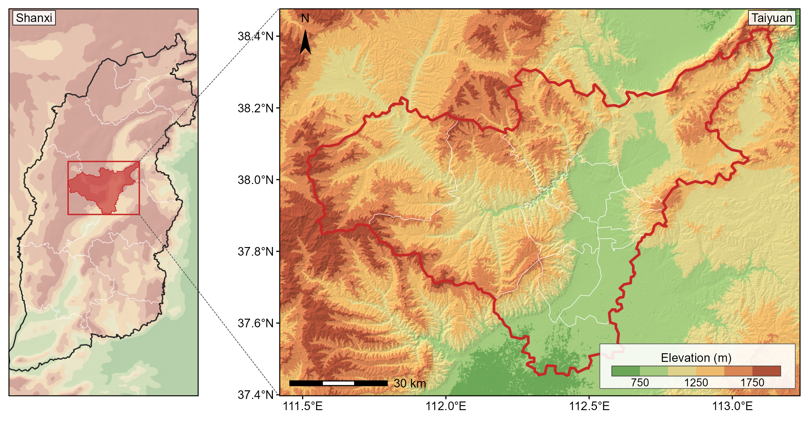

# study-area-map.skill

用 R 绘制论文研究区区位图的 Claude Code 技能。基于 ggplot2、sf、terra。



上图由 `example/taiyuan_locator.R` 生成，190 × 99 mm，300 dpi。左侧省级定位用 GEBCO 0.05° 底图并压低对比度，右侧主图用 ASTER GDEM 30 m，两级由虚线锥连接。高程分级由各自 DEM 的分位自动推出（主图 750/1000/1250/1500/1750 m，定位面板 250 至 1250 m）。

## 功能

- 多级定位面板（国家、省、研究区），各级图框等宽
- 分层设色地形底图，山影按相乘合成，分级边界和饱和度都保留
- 缩放引线，虚线锥连接相邻两级面板
- 图内图例、针形指北针、比例尺
- 投影窗口、DEM 缺值、强调色重复三项自带断言，不合格时报错停止

## 安装

```bash
git clone https://github.com/keros68/study-area-map.skill.git \
  ~/.claude/skills/study-area-map
```

放在 `~/.claude/skills/` 下全部项目可用，放在项目的 `.claude/skills/` 下仅该项目可用。

## 用法

两个模块自带线宽、字号、字体注册与地图主题，加载后即可用。

```r
SK <- "~/.claude/skills/study-area-map/reference/"
source(paste0(SK, "relief_basemap.R"))
source(paste0(SK, "palettes.R"))

CRS_M <- "+proj=aea +lat_1=39.3 +lat_2=40.4 +lat_0=39.85 +lon_0=113.3 +datum=WGS84 +units=m +no_defs"

# 窗口：经纬矩形投影后是弯的四边形，取内接矩形，栅格才能铺满图框
W <- inscribed_window(c(112.0, 114.6), c(39.02, 40.80), CRS_M)

# 地形：分级边界由这份 DEM 自身的 2–98 分位推出，不沿用别处的边界
dem  <- load_dem("F:/DEM", "ASTGTMV003_.*_dem[.]tif$", CRS_M, W, fact = 3)
brk  <- elev_breaks(dem, n = 6)
cols <- pal_hypso("terrain", length(brk) - 1)
rel  <- relief_rgb(dem, brk, cols, strength = 0.42)

ggplot() +
  tidyterra::geom_spatraster_rgb(data = rel) +
  geom_sf(data = aoi, fill = NA, colour = "#C62828", linewidth = LW_DAT * 1.3) +
  north_needle(W) +
  legend_backing(W, c(0.60, 0.99), c(0.02, 0.13)) +
  elev_legend(W, cols, elev_labels(brk)) +
  coord_sf(xlim = W[c("xmin", "xmax")], ylim = W[c("ymin", "ymax")],
           expand = FALSE, crs = CRS_M) +
  theme_map_pub()
```

`load_dem()` 会打印栅格尺寸和缺值比例，缺值超过阈值即停止。窗口越出 DEM 瓦片覆盖时，图框边缘会出现无数据白缝，预览时常被比例尺盖住，所以做成断言。

`example/taiyuan_locator.R` 是完整的两级面板例子，可以照着改。它需要三样本地数据：覆盖 N37–N38 / E111–E113 的 ASTER 压缩瓦片、含市县两级的行政区划 shp、以及 `ggmapcn::check_geodata()` 自动下载的 GEBCO。脚本开头三个路径改成你自己的即可。

多面板拼版的顺序与单幅相反：先用 `pin_panel()` 把各面板尺寸定死，再用 `gridExtra::arrangeGrob()` 按毫米拼，最后由 `box_in()` 算出引线端点。`coord_sf()` 长宽比固定，先摆面板再塞地图会在槽内留信箱边，各面板图框因此不等宽。完整流程见 `SKILL.md`。

## 需要自己准备的数据

仓库不含 shapefile 和栅格。边界数据各地区来源不同，图注需写明出处与版本，随技能分发会丢掉这层信息；DEM 体积大，且已有公开服务。

| 用途 | 来源 | 说明 |
|---|---|---|
| 研究区面板 30 m | ASTER GDEM v3（NASA Earthdata） | 需登录，手动下载瓦片，`load_dem()` 负责合并 |
| 研究区面板 30 m | Copernicus DEM GLO-30 | 开放，无需登录 |
| 国家级面板 | GEBCO 2024，经 `ggmapcn::check_geodata()` | 0.05°，约 24 MB，自动下载 |

GEBCO 为 0.05°，约 5 km，用于国家级面板合适，用于省级面板偏粗。省级面板重采样到 700 m 显示后，图注须写明是概化地形。研究区面板需要真实 30 m DEM。

`ggmapcn` 的 jsDelivr 镜像返回 HTTP 403，函数会自行回退到 `raw.githubusercontent.com`，等它重试即可。

## 模块

| 文件 | 内容 |
|---|---|
| `reference/relief_basemap.R` | `ensure_font()` `theme_map_pub()` `inscribed_window()` `vsizip_tiles()` `fit_aspect()` `win_aspect()` `load_dem()` `locate_na()` `relief_rgb()` `north_needle()` `elev_legend()` `legend_backing()` `pin_panel()` `panel_margins()` `with_font_device()` `box_in()` `add_leaders()` |
| `reference/palettes.R` | `pal_hypso()` `elev_breaks()` `elev_labels()` `assert_accent_unique()` `PAL_SURROUND` `BRK_SURROUND` |

两处做法与常见写法不同。

`relief_rgb()` 先按高程分箱取色，再乘以归一到均值 1 的山影系数，直接输出 RGB 栅格。山影只改变明暗，分级边界与饱和度都保留。常见的 alpha 叠压是朝下层插值，调高埋掉地形，调低埋掉颜色。`wash` 参数把颜色朝白色插值，供需要承载大量叠加符号的底图使用。

色带可复用，分级边界不可复用。`pal_hypso(name, n)` 把命名色带插值到任意级数，`elev_breaks(d, n)` 从该 DEM 自身的分位算出整数级差，首末开区间吸收长尾。四条色带按低地性质选：`terrain` 通用，`arid` 用于低地是荒漠、绿色会误示植被的情形，`alpine` 的顶层读作裸岩，`muted` 为去饱和版。级数取 5 至 8。

## 环境

R ≥ 4.3，ggplot2 ≥ 3.5，另需 sf、terra、tidyterra、ragg、systemfonts、gridExtra。`ggmapcn` 仅在使用 GEBCO 国家级底图时需要。

已验证组合：R 4.6.1，ggplot2 4.0.3，sf 1.1.2（GDAL 3.12.1）。

## 致谢

排版取值（8 pt 正文、1 pt 结构线、数据线加重、物理尺寸导出）沿用 [rfigure.skill](https://github.com/qwlei328-maker/rfigure.skill) 的约定。本技能自带这些常量，不需要另外安装。

已有 rfigure.skill 的用户可以照旧用 `theme_qw_pub()`：本技能只在 `LW`、`TXT_GG` 等尚未定义时才赋值，不覆盖已有定义。

## 许可

MIT
